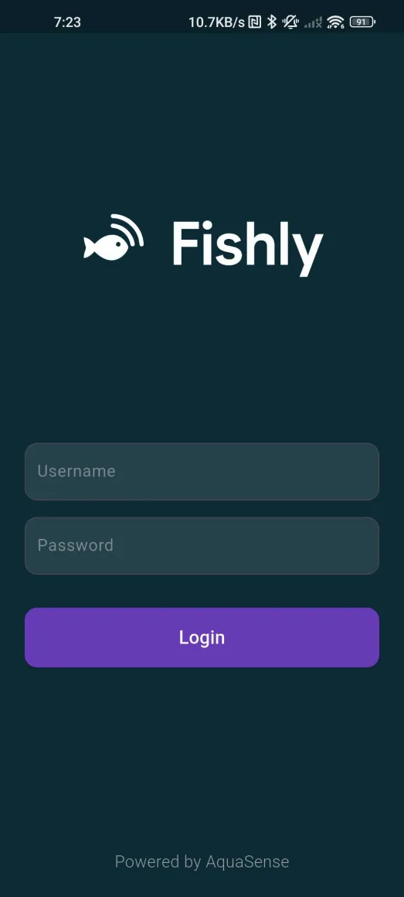
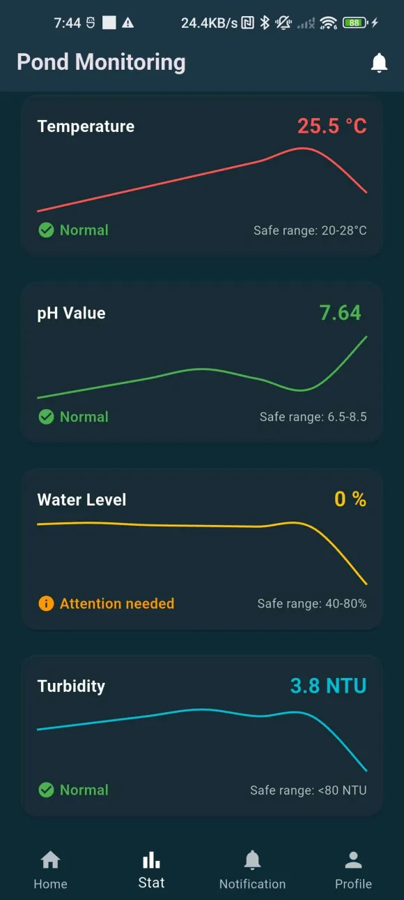
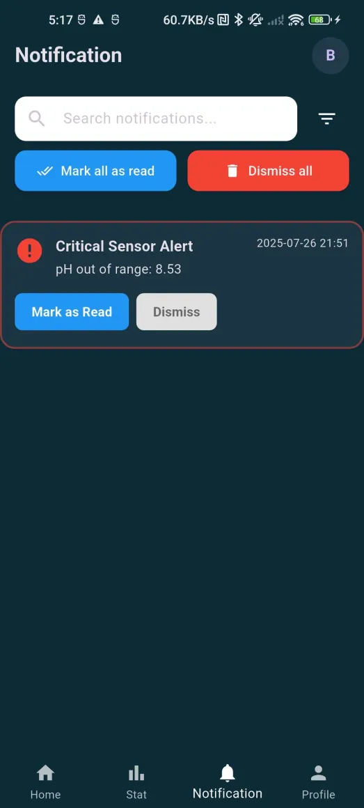

# AquaSense - IoT Aquaculture Monitoring System

A comprehensive IoT solution for monitoring aquaculture systems using Flutter mobile app, Raspberry Pi sensors, and Firebase real-time database.
## Mobile App Screenshots

### Dashboard


### Login Page


### Statistics Page


### Profile Page


### Notifications


## Features

### Mobile App (Flutter)
- **Real-time sensor monitoring** - Temperature, pH, water level, and turbidity
- **Interactive charts** - Historical data visualization with FL Chart
- **Smart notifications** - Critical alerts when values exceed safe ranges
- **Dark/Light themes** - Customizable UI experience
- **Unit conversion** - Metric/Imperial temperature units

### Sensor Monitoring
- **Temperature**: DS18B20 waterproof sensor (Safe range: 20-30°C)
- **pH Level**: Analog pH sensor (Safe range: 6.5-8.5)
- **Water Level**: Analog water level sensor (Alert when >80%)
- **Turbidity**: Analog turbidity sensor (Alert when >80 NTU)

### Backend Services
- **Firebase Realtime Database** - Live sensor data storage
- **Firebase Functions** - Automated threshold monitoring
- **Local SQLite logging** - Backup data storage on Raspberry Pi

### Prerequisites
- **Hardware**: Raspberry Pi, DS18B20, pH sensor, water level sensor, turbidity sensor, ADS1115 ADC
- **Software**: Flutter SDK, Firebase account, Python 3.x
- **Services**: Firebase project with Realtime Database enabled

### Software Installation

#### 1. Raspberry Pi Setup
```bash
# Install required Python packages
pip install pyrebase4 adafruit-circuitpython-ads1x15

# Clone and setup sensor reading script
# Update Firebase config in ASsystem.py
python ASsystem.py
```

#### 2. Flutter App Setup
```bash
# Install Flutter dependencies
flutter pub get

# Configure Firebase
# Add your google-services.json (Android) and GoogleService-Info.plist (iOS)

# Run the app
flutter run
```

#### 3. Firebase Functions Setup
```bash
# Initialize and deploy monitoring functions
firebase init functions
firebase deploy --only functions
```
## 🔧 Configuration

### Firebase Configuration
Update `ASsystem.py` with your Firebase credentials:
```python
config = {
    "apiKey": "your-api-key",
    "authDomain": "your-project.firebaseapp.com", 
    "databaseURL": "https://your-project.firebasedatabase.app",
    "projectId": "your-project-id",
    "storageBucket": "your-project.appspot.com",
    "messagingSenderId": "your-sender-id",
    "appId": "your-app-id"
}
```

### Sensor Calibration
- **pH Sensor**: Calibrate using pH 4.0, 7.0, and 10.0 buffer solutions
- **Temperature**: DS18B20 is factory calibrated
- **Water Level**: Adjust voltage thresholds based on tank height
- **Turbidity**: Calibrate with known NTU standards

## 🔔 Notification System
The system automatically monitors sensor values and sends notifications when:
- Temperature exceeds safe aquaculture ranges
- pH levels become harmful to fish
- Water levels require attention
- Turbidity indicates water quality issues

### Sensor Debugging
```python
# Add debug output to see raw sensor values
print(f"Raw voltage: {voltage:.3f}V, Calculated pH: {ph_value:.2f}")
```
## 🎯 Future Enhancements

- [ ] Water quality predictions using Machine Learning
- [ ] Multiple pond management
- [ ] Export data analytics
- [ ] Integration with feeding systems
- [ ] Weather API integration
- [ ] Multi-language support

-----------------------------------------------------------

**Built with ❤️ for sustainable aquaculture monitoring**
